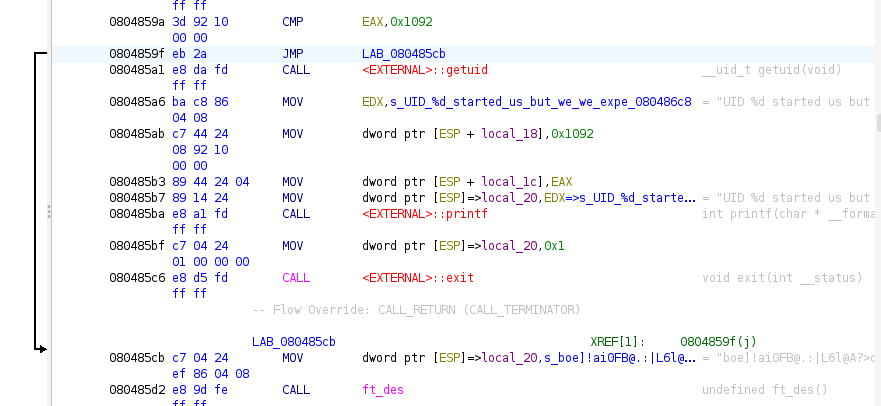

création d'un executable patché qui bypass la vérification de l'UID:
void main(void)

{
  __uid_t _Var1;
  undefined4 uVar2;
  
  _Var1 = getuid();
  if (_Var1 != 0x1092) {
    _Var1 = getuid();
    printf("UID %d started us but we we expect %d\n",_Var1,0x1092);
                    /* WARNING: Subroutine does not return */
    exit(1);
  }
  uVar2 = ft_des("boe]!ai0FB@.:|L6l@A?>qJ}I");
  printf("your token is %s\n",uVar2);
  return;
}

(changement du JZ après le CMP par un JMP sans condition)

l'executable call ft_des et nous donne le flag sans avoir à comprendre toute la fonction

level00@SnowCrash:~$ ls
level13_patched
level00@SnowCrash:~$ chmod +x level13_patched 
level00@SnowCrash:~$ ./level13_patched 
your token is 2A31L79asukciNyi8uppkEuSx